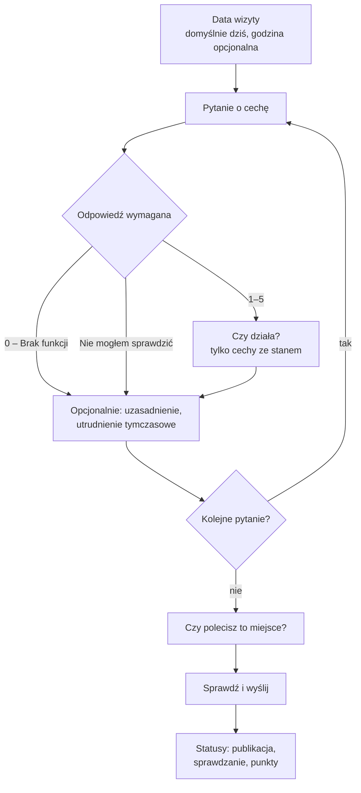

# KindSpot — ankieta recenzji miejsca (UC-05, UC-06)

Wersja: 2, 2026-10-03. Status: przykładowa ankieta do PoC, przygotowana na polecenie użytkownika z 2026-10-03 (wznowienie prac nad ankietą). Zestaw pytań i identyfikatory nowych cech są propozycją do odbioru, patrz [mapowanie pytań](KindSpot-mapowanie-pytan.md) i [DO-USTALENIA.md](DO-USTALENIA.md).

Recenzja to jeden wspólny formularz dla wersji krótkiej i szczegółowej. Użytkownik odpowiada na pytania dopasowane do jego potrzeb.

## Decyzje obowiązujące

| Temat | Ustalenie | Źródło |
|---|---|---|
| Ocena 3 | Ocena pośrednia zgodna z etykietą cechy, nie „brak zdania” | Teoria aplikacji E, kontrakt §3 |
| Brak funkcji | Na ekranie „0 – Brak funkcji”. W API `presence: absent`, `rating: 0`, `operationalState: null` | Teoria aplikacji E, kontrakt §3 |
| 0 a średnia | Ocena 0 **nie wlicza się do średniej** oceny cechy | Decyzja użytkownika 2026-10-03 |
| Niewiedza | Na ekranie „Nie mogłem sprawdzić”. W API `presence: unknown`, `rating: null` | Teoria aplikacji E, kontrakt §3 |
| Wymagana odpowiedź | Każde pokazane pytanie wymaga odpowiedzi: 1–5, „0 – Brak funkcji” albo „Nie mogłem sprawdzić” | Teoria aplikacji E |
| Data i godzina | Data domyślnie dzisiejsza, z możliwością zmiany, nie z przyszłości. Godzina opcjonalna, wpisywana samodzielnie | Teoria aplikacji E, UC-05 |
| Polecenie miejsca | Ekran „Czy polecisz to miejsce?”, pole `recommendation` w kontrakcie | Decyzja użytkownika 2026-10-03 |
| Zdjęcia | Decyzja otwarta, poza PoC | DO-USTALENIA |

## Przebieg

## Ekran pytania o cechę

### Odpowiedź (wymagana)

Jedna grupa wyboru z siedmioma opcjami:

| Opcja na ekranie | `presence` | `rating` | Dalej |
|---|---|---|---|
| 1–5 z etykietą cechy (`ratingLabels`), np. „4 – Wygodny” | `present` | 1–5 | stan działania, jeśli cecha go ma |
| 0 – Brak funkcji | `absent` | 0 | bez stanu |
| Nie mogłem sprawdzić | `unknown` | null | bez stanu |

Cechy bez oceny jakości (`ratable: false`, np. pies przewodnik) mają opcje: „Tak”, „0 – Brak funkcji”, „Nie mogłem sprawdzić”. „Tak” daje `present`, `rating: null`.

Etykiety 1–5 pochodzą z katalogu cechy. Dla cech środowiskowych 5 zawsze znaczy „dobrze dla mnie”, np. hałas: 1 „Bardzo głośno” … 5 „Bardzo cicho”.

### Stan działania (opcjonalny, tylko 1–5 lub „Tak” i cecha z `operational: true`)

| Opcja | `operationalState` |
|---|---|
| Działa | `working` |
| Ograniczona dostępność | `limited` |
| Nie działa | `not_working` |
| Nie wiem | `unknown` |

Działanie i jakość są osobne (kontrakt §3): winda może mieć ocenę 4 i jednocześnie „Nie działa”.

### Szczegóły (rozwijane, UC-06)

- **Uzasadnienie** → `comment`, np. „4, bo podjazd jest dobry, ale trochę stromy”. Przykładowy szkic odpowiedzi (Teoria aplikacji E) jest tylko podpowiedzią w polu, nie trafia do recenzji bez świadomego użycia.
- **Utrudnienie tymczasowe** → wpis w `temporaryIssues`: rodzaj (Remont → `construction`, Awaria → `outage`, Inne → `other`) i opis, np. „Brak podjazdu, bo go budują”.
- **Konkretne wejście lub część** (cechy, które mogą występować w kilku miejscach): wybór istniejącej części miejsca albo nowa część z nazwą, np. „Drzwi od ul. Białej”. Nowa część trafia do `newParts`. Odpowiedź bez wskazanej części dotyczy całego miejsca.

## Ekrany stałe

| Ekran | Treść | Pola API |
|---|---|---|
| Start | Nazwa miejsca, informacja o danych demonstracyjnych, liczba pytań | – |
| Data wizyty | „Kiedy była wizyta?” Data (domyślnie dziś), godzina (puste pole, opcjonalne) | `visitedOn`, `visitedAtLocalTime`, `timeZone` |
| Pytania | Jedno pytanie na ekran, „Pytanie 3 z 7”, „Wstecz” i „Dalej” | `answers[]` |
| Polecenie | „Czy polecisz to miejsce osobom z podobnymi potrzebami?” 1–5 | `recommendation` |
| Podsumowanie | Lista odpowiedzi z przyciskiem „Zmień” | – |
| Wynik | Trzy osobne statusy | `publicationStatus`, `verificationStatus`, `pointAward` |

## Komunikaty

| Sytuacja | Komunikat |
|---|---|
| „Dalej” bez odpowiedzi | „Wybierz odpowiedź. Jeśli nie wiesz, wybierz „Nie mogłem sprawdzić”.” Komunikat zostaje przy pytaniu i jest odczytywany przez czytnik |
| Data z przyszłości | „Data wizyty nie może być późniejsza niż dziś.” |
| Błąd wysłania | „Nie udało się wysłać. Twoje odpowiedzi są zachowane. Spróbuj ponownie.” |
| Wysłanie w PoC | „Recenzja zapisana w wersji demonstracyjnej. Nie została wysłana do systemu.” |

## Ekran wyniku

| Status | Tekst w PoC |
|---|---|
| Publikacja | „Demo: recenzja nie została opublikowana, bo nie ma połączenia z systemem.” Po podłączeniu API: `visible` → „Recenzja jest widoczna”, `hidden_pending_moderation` → „Recenzja czeka na moderatora” |
| Sprawdzanie | „Demo: brak sprawdzania.” Po podłączeniu: `pending` → „Sprawdzamy recenzję” |
| Punkty | „Demo: punkty przyznaje tylko system.” Bez wymyślonej kwoty |

Recenzję sprawdza bot; przy wątpliwościach moderacja. Głosy innych osób (lajk/dislajk przy cesze) są osobną funkcją.

## Pytania

Pełna lista, przypisanie do potrzeb i identyfikatory: [mapowanie pytań](KindSpot-mapowanie-pytan.md).
